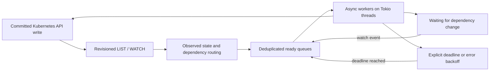

# Event-driven control plane (turbomode)

Status: partial migration; five-crate unit/doc tests pass through `sc-build`
at `fc67179` on 2026-09-29 (four storage integration tests ignored). Live
validation awaits the owner-selected target. Branch: `turbomode`.

Current implementation: Deployment, ReplicaSet, StatefulSet, DaemonSet, Job and CronJob
have indexed per-object workers (eight concurrent keys per controller).
Collection watches and snapshots are shared; successful writes use local
acknowledgement overlays until observed or superseded by a consistent LIST
begun after the write. Deletion uses observed UID/revision preconditions.
Other controller migrations and runtime validation remain open.

## Objective and boundary

Keep the Kubernetes HTTP APIs, object schemas, resourceVersion/CAS, watches,
RBAC, admission, finalizers, and leader-election Leases. Replace periodic
searches for work with state changes that make work runnable immediately.
The datastore remains external fastetcd; controllers still use the API server.
This is an internal execution redesign, not a new Kubernetes dialect.

The target is p99 below one second from an accepted workload write to control
plane convergence on a healthy, warmed cluster with capacity. Measure direct
Pod creation to binding, Deployment creation to bound Pods, PVC binding, and
foreground deletion separately. Record image-cache state and storage driver.
Container process start also requires rustkube-node, the runtime, image and
volume operations: this repository cannot promise subsecond image downloads
or manufacture a Ready condition before the node reports it. The reported
six-second and two-minute observations are symptoms, not a measured baseline.

## Evidence in this branch

Deployment → ReplicaSet → scheduler currently crosses 2 s + 2 s + 1 s poll
intervals, before node startup. The claim path crosses stormblock 2 s, PV
binder 3 s, attach/detach 5 s and scheduler 1 s (#142). Controllers repeatedly
LIST entire collections. Garbage collection starts every 30 s and delays
follow-up passes by 2 s. More workers alone will not remove these waits.
The scheduler also renews its leader lease inside its scheduling tick: lease
maintenance and placement must become independent tasks.

## Execution model

The useful part of the realtime C model is explicit queue membership and
short critical sections. Use safe Rust `VecDeque` plus hash maps/sets, rather
than raw intrusive linked-list pointers. They provide constant-time enqueue,
dequeue and membership lookup without pointer ownership hazards. A task never
holds a queue/state lock across an await or network request. Tokio runs ready
futures across its multithreaded executor; waiting work consumes no thread.
Do not create a thread or an unbounded task per incoming event.

A work item has these states:

* Idle / waiting: no executable work until a dependency changes.
* Ready: appears once in the FIFO, however many duplicate events arrive.
* Processing: one worker owns it; new events set a dirty bit.
* Processing + dirty: completion places it at the tail exactly once.
* Delayed: an explicit earliest deadline, cancellable/replaced by new state.
* Stopped: leadership lost or shutdown; stop readers and drop pending work.

Register notification interest before checking the queue. This prevents the
empty-check/sleep lost-wakeup race. Completion after cancellation must not
leave a permanent processing entry. Do not drop the last change during a
reconcile. Fairness is FIFO between distinct keys; a hot key cannot occupy
multiple workers. Errors receive bounded exponential backoff, not busy retry.

## Observation and consistency

One reflector per collection per process shares authenticated HTTP transport.
Obtain every LIST page at a consistent resourceVersion, then WATCH from that
revision. A write between LIST and WATCH is replayed. Frame newline-delimited
JSON incrementally across arbitrary network chunks; bound a frame's memory.
Bookmarks advance the reconnect revision without scheduling work. Reconnect
from the last applied revision; on 410 discard the old view and relist.
Transport failures back off with a cap. A 403 or unavailable optional API is
not an empty collection; retries must be visible and paced. A relist must
wake dependents even if the events that caused it were lost.

Keep resource versions as opaque strings. An object UID distinguishes delete
and recreate at the same name. Cache updates precede queue notification;
route deletions using old state and additions using new state. Dependency
indexes must use both sides of an update when a label, owner or node changes.
Do not ignore all status changes: Pod readiness, PVC binding and attachment
status are essential inputs. Ignore a write whose only changes are
resourceVersion/managedFields; otherwise status-write echoes can spin.
Controllers should avoid unchanged status writes as well.

The migration begins with an event-driven adapter around the existing
reconcilers: dependency collections discovered by their reads feed a
coalescing queue for each controller. Reads remain authoritative paginated
API LISTs during this step; watch state is used for change detection, not as
an unsafe replacement for a consistent LIST. This removes intentional wait
latency while retaining existing reconciliation decisions. It is explicitly
not the final scaling architecture: controller-wide passes still cost O(N).

The next step narrows work keys to (controller, namespace, name, UID) and
moves read-mostly state into indexed snapshots. Keep create expectations and
acknowledged write overlays until the corresponding watch revision arrives:
a lagging cache must never manufacture duplicate replicas or free a node's
reserved resources. GET and CAS remain the authority for destructive actions.
GC must never infer owner absence from an unsynchronized or failed list.

## Dependency routing

The node uses one workload execution framework for Pods and VMIs. Both enter
the same bounded ready queue, keyed by kind, namespace, name and UID. They
share dependency routing, retry/deadline handling, claim reservations,
cancellation and status-delivery machinery. Runtime adapters implement only
the operations that differ (container/init-container lifecycle versus VM
process/disk lifecycle). There are no separate Pod and VM scheduling policies
or worker pools. A slow workload consumes only its own execution slot and
resource reservations, irrespective of kind.

| Worker | Changes that make it ready |
|---|---|
| Deployment | Deployment spec/deletion, owned ReplicaSet spec/status |
| ReplicaSet / StatefulSet / Job | owner spec/deletion, owned Pod status/deletion |
| DaemonSet | DaemonSet, relevant Node eligibility, owned Pod |
| Scheduler | pending Pod/VMI, Node, bound Pod resource release, PVC/PV, StorageClass, CSI capacity |
| PV binder / stormblock | PVC, PV, StorageClass, Pod selected-node/use |
| Attach/detach | Pod placement/deletion, PVC/PV, CSIDriver, VolumeAttachment |
| Service / PDB | selector and Pod membership/readiness changes |
| VM / migration | VM/VMI, migration object and dependent workload state |
| Namespace / root CA | Namespace, default ServiceAccount or published ConfigMap |
| CSR | CSR request, approval and signing state |
| GC | discovered resource membership, owner refs, deletion/finalizers, CRD discovery |

Initially, reading a collection registers the worker's dependency before
performing the LIST. This avoids hand-maintained incomplete subscription
lists, including dynamically discovered GC/namespace resources. Registrations
are scoped to the worker's lifetime and must be cleaned up on cancellation.
The indexed implementation will replace broad routes with inverse indexes
(owner UID → dependents, PVC → Pods, node → Pods, selector → candidates).
Do not watch secret contents unless a controller actually needs them.

## Timers that have a reason

A successful idle reconciliation schedules no periodic refresh. Explicit
requeue deadlines are permitted for:

* Leader lease renewal and expiry; renewal runs independently of workers.
* Failed API calls or watch transport recovery, using capped backoff.
* Failed workload recreation (existing crash-loop protection).
* Node heartbeat expiry and eviction toleration deadlines.
* Job activeDeadlineSeconds, VM retryAfterTimestamp, migration timeouts.
* CronJob's next calendar occurrence; recalculate after changes/clock jumps.
* Event retention, graceful deletion, and genuinely sampled external metrics.

Each deadline names its reason and uses monotonic time for waiting. Absolute
API timestamps are converted at reconciliation; persisted timestamps survive
restart. A new dependency event may wake work sooner but must not bypass a
semantic backoff, grace period or starting deadline. No 100 ms replacement
poll loop, no periodic safety sweep hiding missing event routes. A bounded
recovery retry is acceptable only after an actual failure.

## Leadership, concurrency and failure

Controller families run concurrently; namespace provisioning is independent
of namespace teardown. Per-object workers will be bounded and tunable.
Scheduling resource reservations remain serialized until reservation/rollback
is atomic; parallel HTTP binding cannot double-spend node capacity. A leader
term owns its workers and subscriptions. Loss of renewal cancels them before
starting a new term. All writes still obey UID/resourceVersion preconditions;
watch notifications confer no authority to write.

An overload coalesces keys instead of allocating one task per event. Memory
is bounded by observed objects and distinct dirty keys. Recovery resync is
explicit after watch loss, not normal-operation polling. Queue depth, oldest
ready age, reconcile duration/outcome, watch reconnects, deadline reasons and
commit-to-bind latency distinguish throughput from artificial wait latency.

## Validation and rollout

1. Deterministic queue tests: duplicate events, events during processing,
   cancellation, earlier/later deadline replacement and no lost wakeups.
2. Fake HTTP server tests: paginated LIST, list/watch gap, split frames,
   bookmark, disconnect/reconnect, 410, non-2xx, deletion/recreation and noop
   resourceVersion writes. A failed LIST must never look like empty state.
3. Controller tests: a dependency change wakes immediately; stable state
   causes no repeated work; failure retry still progresses without an event.
4. Scheduler: independent lease renewal, leadership loss cancellation,
   unschedulable work wakes on capacity/volume changes, no double reservation.
5. Real control plane: warm Pod/Deployment/PVC/foreground-delete latency
   distributions; idle request/CPU rates; burst churn at 250 and 1000 nodes;
   watch interruption, compaction and leader failover. Report sample size,
   p50/p95/p99/max and environment. Do not label unit-test latency a cluster SLO.
6. Run component tests through the repository's remote build workflow;
   conformance and real-node tests run outside build slots.

Ship on turbomode in reviewable increments: runtime and watch transport;
controller migration and semantic deadlines; scheduler separation; indexed
object workers and safe cache reads; latency/fault validation. Existing
issues #142 (stacked waits), #113 (Service write latency), #66 (scale), and
#127 (watch compaction) remain linked, not silently considered solved.

References: [Kubernetes API LIST/WATCH semantics](https://kubernetes.io/docs/reference/using-api/api-concepts/#efficient-detection-of-changes)
and [Tokio Notify wakeup rules](https://docs.rs/tokio/latest/tokio/sync/struct.Notify.html).

## Owner-supplied release baseline: C2NR0Q2

Measured on each OS-release install; provided 2026-09-29. Empty entries and
em dashes below both mean no reported measurement, not zero. Instrumentation
boundaries, sample counts, image warmth and polling granularity are not yet
verified. These are observations, not percentiles.

| Metric | 11.44 | 11.45 | 11.46 | 11.48 | 11.49 | 11.50 | 11.51 |
|---|---:|---:|---:|---:|---:|---:|---:|
| boot → SSH | 272s | 254s | 254s | 257s | 235s | 289s | 287s |
| boot → apiserver ready | 272s | 254s | 254s | 257s | 235s | 289s | 287s |
| boot → node Ready | 272s | 254s | 254s | 257s | — | 289s | 287s |
| boot → all pods running | 374s | 359s | — | 299s | — | 349s | 346s |
| container start | 12s | 12s | — | 12s | — | 21s | 21s |
| claim bind + mount | — | — | — | — | — | 76s | 67s |
| VM start | — | — | — | — | — | — | — |
| reboot → SSH | — | — | — | — | — | 183s | — |
| reboot → apiserver ready | — | — | — | — | — | 215s | — |
| reboot → node Ready | — | — | — | — | — | 215s | — |
| reboot → all pods running | — | — | — | — | — | 215s | — |

Container start regressed 12 → 21 seconds (+75%); claim bind/mount improved
76 → 67 seconds (~12%) but remains far from the target. Boot measurements
need separate firmware, OS, storage, service-start and readiness timestamps.
Identical SSH/API/Node times may be a sampling artifact; establish metric
implementation before assigning cause. Preserve the per-machine/per-release
history and add distributions and stage timestamps to it. VM startup needs a
measurement before any performance claim.

## Branch tracking

- [#143: runtime and watch transport](https://github.com/glennswest/rustkube/issues/143)
- [#144: controller events and deadlines](https://github.com/glennswest/rustkube/issues/144)
- [#145: event-driven scheduler](https://github.com/glennswest/rustkube/issues/145)
- [#146: indexed object workers and safe cache reads](https://github.com/glennswest/rustkube/issues/146)
- [#147: measured latency and fault validation](https://github.com/glennswest/rustkube/issues/147)
- [rustkube-node#99: paired node architecture](https://github.com/glennswest/rustkube-node/issues/99)

The node repository has its own `turbomode` branch and design. Its initial
migration separates Pod and VM workers, watches assignment/volume state,
notifies on engine exits and Linux manifest changes, and protects live Pods
from incomplete reads. Per-UID concurrency and the remaining runtime/volume
observation fallbacks still require implementation and real-node validation.

## Multi-master Kubernetes is a required deployment mode

This design must ship for a traditional highly available control plane, not
just a single-master cluster. Multiple API servers are active behind the
stable Kubernetes VIP/load-balanced endpoint, all using the same external
fastetcd quorum. Each master may run a scheduler and controller manager;
these have separate Kubernetes Lease elections. Nodes connect through that
endpoint and do not depend on the master that accepted a write staying alive.

Local queues are disposable acceleration state, never the cluster authority.
A worker on master B learns about writes accepted by API server A through the
revisioned shared datastore/API watch path. No direct in-process signal, sticky
session, shared local filesystem or node-local revision counter is required
for correctness. Controller leader changes reconstruct desired work and
persisted deadlines from a complete initial observation. A reconnect may land
on a different API server with a colder watch cache; it must resume at the
cluster resourceVersion or relist on 410, without silently starting from now.

Lease ownership uses a unique identity for each process incarnation and
resourceVersion CAS. Renewal runs independently of busy/idle reconciliation,
with a request deadline shorter than the lease. A failed/expired renewal
cancels the entire worker term and its subscriptions. Explicitly configured
identities must also be unique. Standbys do no controller mutations. The
15-second lease and its renewal timing are intentional failure-detection
semantics, not latency gates in a healthy create/bind path. Measure takeover
time separately; do not promise subsecond failover by silently shortening it.
Candidates measure an unchanged foreign lease using local monotonic elapsed
time. Remote `renewTime` values indicate a changed record, not trusted local
time. This follows the [client-go lease observation approach](https://github.com/kubernetes/client-go/blob/master/tools/leaderelection/leaderelection.go),
which tolerates clock offsets but still assumes bounded clock-rate differences.

Lease election alone is not fencing: an old leader can pause with a request
already in flight. Placement and destructive operations therefore need UID
and resourceVersion preconditions, conflict handling, safe create identity
and idempotent retry. A returned HTTP 409 cannot be counted as a successful
binding or a resource reservation. In-memory scheduler reservations are valid
only within one leadership term and are rebuilt from bound Pods/VMIs before
placement in a new term. Concurrent scheduling within a term requires atomic
reservation accounting before adding workers.

API reads must also be correct across replicas: remembering only writes made
by the serving API-server process is insufficient. A most-recent LIST needs
a datastore-backed consistent snapshot or a quorum-established revision and
a cache known to contain it. Continuation pages must retain the same snapshot
when a load balancer changes servers. A failed, stale or unsynchronized cache
cannot authorize garbage collection, namespace finalization or node cleanup.

The initial implementation uses authoritative datastore Range reads for LIST,
with the first revision pinned on subsequent pages. This removes the old
process-local recent-write freshness shortcut. It costs datastore reads until
the indexed informer migration (#146) supplies a verified cache read barrier.
Watch compaction, cache eviction and subscriber lag terminate the stream with
a Status error and force recovery rather than silently dropping changes.

Required three-master tests: write on A/read on B; watch failover A→B; kill
each API server; kill controller and scheduler leaders independently; partition
a minority master; pause a leader beyond lease expiry and resume it; lose
and restore datastore quorum; restart nodes while API servers rotate. Assert
no duplicate binding, no resource overcommit, no incorrect deletion and no
missed work; record healthy-path and takeover latency separately. This is an
acceptance gate, tracked in #149, not an optional follow-up benchmark.

### Requested cluster load acceptance

Run two sequential stress profiles against an explicitly selected test cluster:

- 100 namespaces with ten single-container Pods each (1,000 containers), each
  sleeping for 120 seconds with restartPolicy Never.
- 100 single-container Pods in 100 namespaces, each with a distinct fresh PVC.
  Write 1,000 Pod-specific SQLite records, commit with synchronous FULL, close
  and reopen, compare every record and checksum, and run integrity_check.
  Sleep 120 seconds and reopen and verify the database again before exiting.

The opt-in harness is `stormcos_qa/tools/turbomode/run.py`, outside automatic
per-release QA discovery. Record image identity, release/machine, exact resource
UIDs, API acknowledgement and watch-observed lifecycle latency percentiles,
sample counts, peak observed Running concurrency and per-container integrity
logs. Missing watch samples cannot establish subsecond performance. Record cold
image/template work separately from warm runs. No live results exist yet.

Both profiles clean their own namespaces with UID preconditions. SQLite
acceptance additionally requires PVC/PV/VolumeAttachment disappearance and a
read-only backend audit proving that backing clones and their allocated blocks
were reclaimed, with no surviving mounts or Pod state directories. Preserve
shared image/template allocations; never force finalizers or directly remove
backing storage to make cleanup pass. Unreachable storage or incomplete inventory
fails verification. Cleanup failures retain exact resource identities and
evidence for investigation. Track these acceptance runs under #147 and
rustkube-node#102; neither issue closes on harness creation alone.
